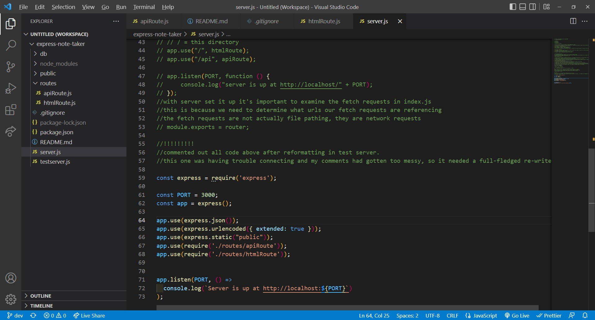
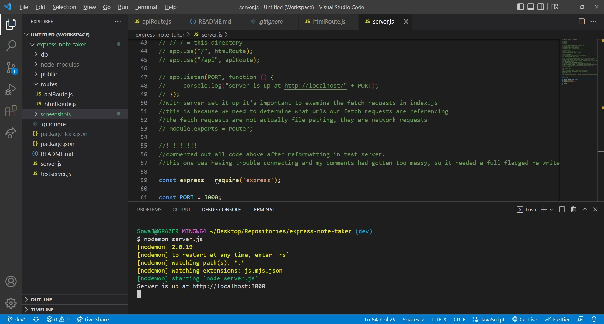
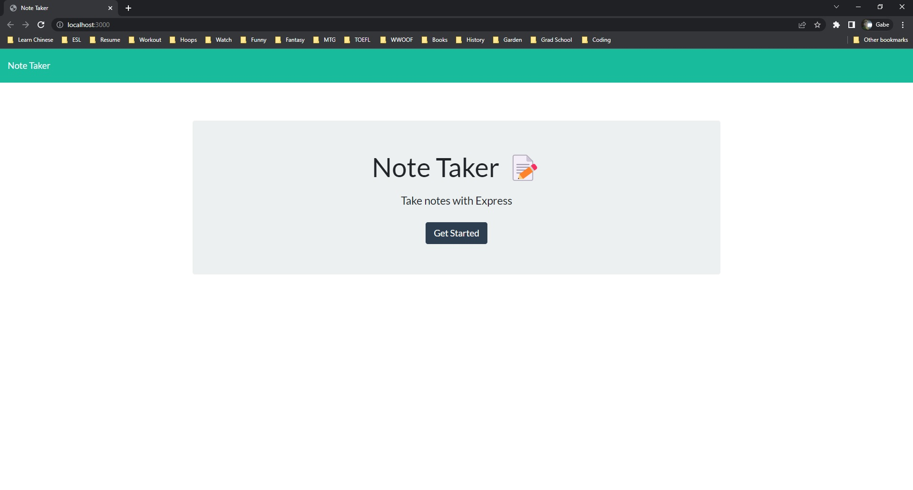
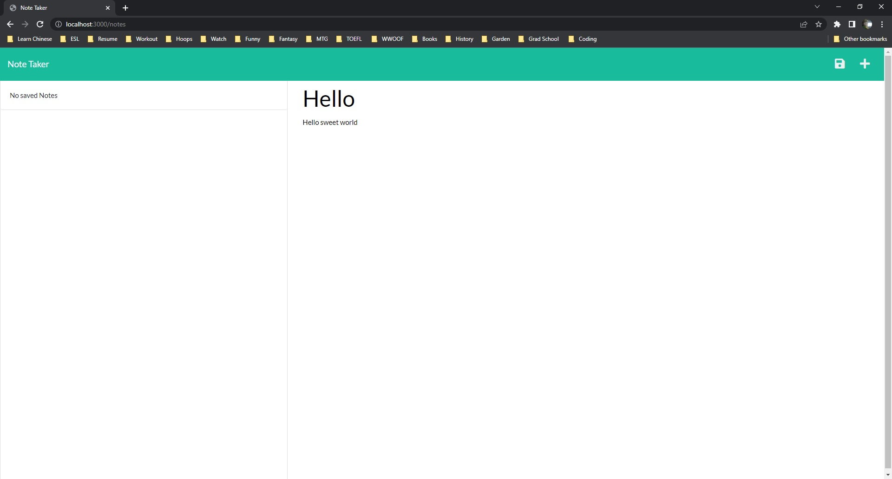
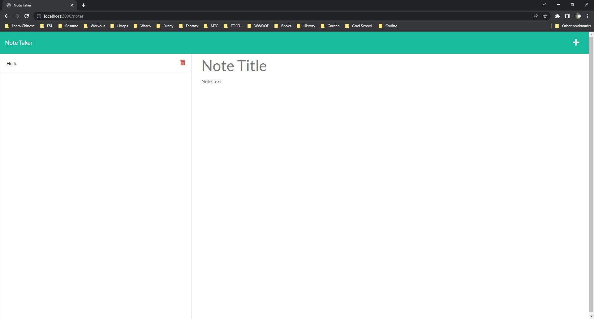

# express-note-taker

## Video Walkthrough Link https://drive.google.com/file/d/15nS4FteYlbf63dtKkKVCFZ4hT8OhClmU/view

## Table of Contents

- [Description](#description)
- [Installation](#installation)
- [Usage](#Usage)
- [Bugs](#Bugs)
- [Screenshots](#screenshots)
- [Credits](#credits)

## Description

This was a back-end project focused on creating the supporting database for a note-taking app.

- The motivation for creating this project was continuing to develop node.js skills that integrate traditional javascript with the node runtime environment while adding in the additional challenge of creating a live server node that mimics a request/response environment between a server and a user-space.
- I built this project largely in order to continue to get practice with the skills we are working on in class. While most of our experience in class thus far has been dealing with front-end development, we have begun to transition toward back-end data retrieval via API fetches, CRUD commands, and eventually SQL databases. This project was a start in learning how to create a server instance working with Express npm, allowing the developer to create a full-fledged app that retrieves, parses, and stringifes JSON objects in order to print them to a page.
- This is a useful project in that it enables a user record, store, and delete notes (likely to-do or remember notes) via a simple interface that encourages easy interaction and uses a straightforward UI. From the user-end, there is no detectable difference between the local-storage interfacing we were working with earlier in the class in vanilla JS and this backend storage that utilize json databases to store saved information, but the result is the same as long as the server is live. While this project currently needs to be run through node.js, it could be expanded to be true server-side and be utilized by people with a need to record notes.
- This project was difficult in that it introuduced entirely fresh new npms and methods, particularly Express and app/routing. It was an enjoyable project in that it seemed there were several different paths toward accompishing the same end result as far as the actual code; I chose to use a router instance and routing paths to abide by the separations of concerns principle and keep my server file clean. I am excited to continue to learn about servers and data fetches in the future- this project was an exciting introduction to both and a nice departure from the logic of vanilla js in previous projects.

## Installation

- Running this node requires Express and UUID npms, both of which can be installed via the node terminal in the command line prompt (such as Git Bash, CMD, or Powershell). The user can install such npms with a simple npm i _package_ line, which will quickly and cleanly install the npms for the duration of their terminals life. The server can be loaded in the command line by using node server.js, which opens the port to its scheduled variable and starts the server listening.

## Usage

- Using this app is quite simple once the user is in the browser. Once the index page is loaded, the user can click "get started" and this will take them to the notes page. Once they are there, they may click in the note title section in order to enter a title for their note, and in the body section in order to enter a body. Following, they may click the save button in the top right hand corner (floppy disk icon) in order to save the note, which will be served in the live server database and persist. Finally, they may click the trash can icon next to a saved note to delete the note and the plus icon in the top-right hand corner while writing a note in order to toss it and begin a note anew.

## Bugs

- There are no known major bugs afflicting the program. I am not entirely sure the plus button in the upper right hand corner is working correctly. I am not sure what it was intended to do, but it currently starts a note anew if a user clicks it mid-note.

## Screenshots

- 
- 
- 
- 
- 

## Credits

- This project could not have been completed without the hardwork and excellent advice of my educators at UW Fullstack and tutor, Jacob Carver.
